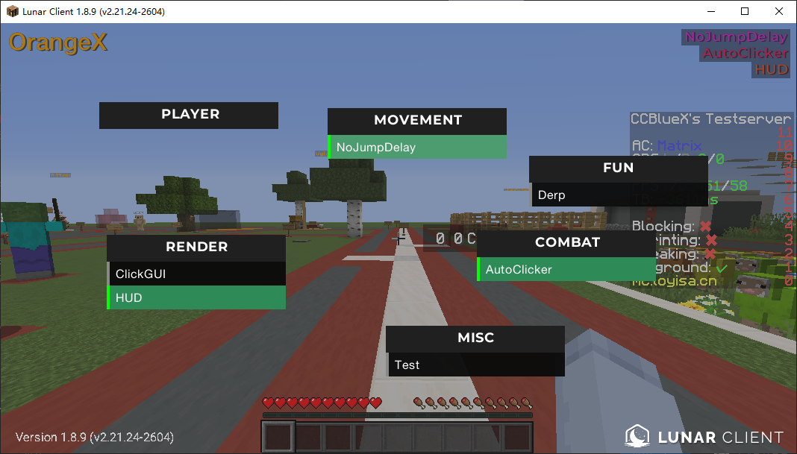
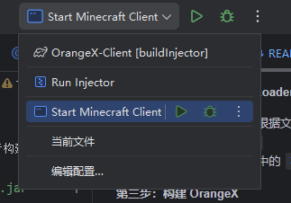

# OrangeX Client

## Language: [中文](./README.md) | [English](./README_EN.md)

## Supported Injectable Clients

Currently, only non-obfuscated clients are supported. The following clients have been tested:

| Client             | Description                                |
| ------------------ | ------------------------------------------ |
| MCP 1.8.8          | Local development environment based on MCP |
| Lunar Client 1.8.9 | Adapted third-party client                 |

---

## How to Build

### Method 1: Direct Build

> The project already includes prebuilt dependencies and can be built directly.

* Run `./gradlew buildInjector` to build the project
* After the build completes, `Injector.jar` will be generated in the `out/` directory
* Launch the injector using `java -jar Injector.jar`

---

### Method 2: Rebuild Dependencies

> Suitable for cases where you need to compile the underlying dependencies yourself.

#### Step 1: Download or Build JuiceAgent

* In the [JuiceAgent](https://github.com/xiaozhou233/JuiceAgent) project, build it according to the documentation or download a precompiled version

* Obtain the following files:

  * `libagent.dll`
  * `libinject.dll`
  * `libjuiceloader.dll`

* Replace the corresponding DLL files in the `natives` directory

#### Step 2: Download or Build JuiceLoader

* In the [JuiceLoader](https://github.com/xiaozhou233/JuiceLoader) project, build it according to the documentation or download a precompiled version
* Obtain `JuiceLoader.jar`
* Replace `JuiceLoader.jar` in the `libraries` directory

#### Step 3: Build OrangeX

* Run `./gradlew buildInjector` to build the project
* After the build completes, `Injector.jar` will be generated in the `out/` directory
* Launch the injector using `java -jar Injector.jar`

---

## Development

* Install IntelliJ IDEA
* Open the project with IntelliJ IDEA
* Write code
* Launch the development client using the button in the top-right corner

---

## Acknowledgements

* [FontRenderer](https://github.com/Godwhitelight/FontRenderer) - Font rendering
* [YMixin](https://github.com/yapeteam/YMixin) - Bytecode instrumentation tool for dynamically generating replaceable bytecode
